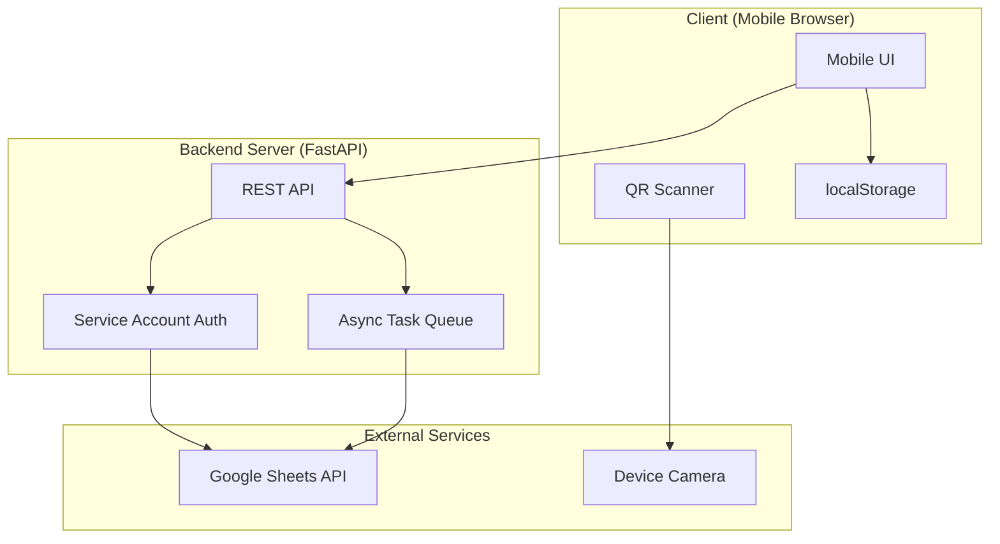

# Design Document: QR Attendance System

## Overview

The QR Attendance System is a mobile-first web application that enables Teaching Assistants to record student attendance by scanning QR codes. The system integrates with Google Sheets as a database backend, providing a familiar interface for TAs to manage student records without requiring complex setup or database administration.

### Design Goals

1. **Beginner-Friendly**: Simple deployment and operation for non-technical TAs
2. **Mobile-Optimized**: Responsive UI designed for smartphone usage in lab environments
3. **Stateless Architecture**: No server-side session management; configuration stored client-side
4. **Asynchronous Operations**: Non-blocking UI that remains responsive during API calls
5. **Offline-First Feedback**: Immediate visual feedback with background data persistence

### Technology Stack Selection

**Backend: FastAPI (Python)**

Rationale:
- Simpler deployment model (single Python process vs. Node.js + build pipeline)
- Excellent async support with native Python async/await
- Built-in API documentation with OpenAPI/Swagger
- Easier for beginners to understand and modify
- Strong Google Sheets API client library (gspread)
- Lightweight and fast for simple CRUD operations

**Frontend: Vanilla JavaScript + HTML/CSS**

Rationale:
- No build step required - simpler deployment
- Direct integration with html5-qrcode library
- Minimal dependencies reduce complexity
- Easy to understand for beginners
- Fast load times on mobile devices

**QR Code Library: html5-qrcode**

Rationale:
- Pure JavaScript, no native dependencies
- Works across mobile browsers
- Simple API for camera access
- Active maintenance and good documentation

**Google Sheets Integration: gspread (Python)**

Rationale:
- Pythonic interface to Google Sheets API
- Handles authentication complexity
- Built-in retry logic and error handling
- Well-documented and widely used

## Architecture

### High-Level Architecture



### Architecture Principles

1. **Stateless Server**: Backend maintains no session state; all session context passed in requests
2. **Client-Side Configuration**: Spreadsheet ID stored in browser localStorage
3. **Async-First**: All Google Sheets operations are non-blocking
4. **Fail-Fast Validation**: Configuration validated before session initialization
5. **Progressive Enhancement**: Core functionality works without JavaScript frameworks

### Component Interaction Flow

**Session Initialization Flow:**
```
1. User opens app → Check localStorage for Spreadsheet_ID
2. If not found → Show configuration page
3. User enters Spreadsheet_ID → Validate access via API
4. Store in localStorage → Fetch sheet names
5. User selects Course_Sheet + Attendance_Column → Start scanner
```

**Attendance Recording Flow:**
```
1. QR code scanned → Extract Student_ID
2. Check client-side cooldown cache
3. If not in cooldown → Send to backend API
4. Backend locates student row → Write "P" to cell
5. Return success/error → Display toast notification
6. Add to cooldown cache with timestamp
```

## Components and Interfaces

### Frontend Components

#### 1. Configuration Page Component

**Responsibility**: Collect and validate Spreadsheet_ID

**State:**
- `spreadsheetId`: string (from localStorage or user input)
- `serviceAccountEmail`: string (fetched from backend)
- `validationStatus`: 'idle' | 'validating' | 'success' | 'error'

**Methods:**
- `loadConfig()`: Retrieve Spreadsheet_ID from localStorage
- `validateSpreadsheet(id)`: Call backend to verify access
- `saveConfig(id)`: Store Spreadsheet_ID in localStorage
- `clearConfig()`: Remove stored configuration

**UI Elements:**
- Text input for Spreadsheet_ID
- Instructions with Service Account email
- Validation status indicator
- Settings button to reconfigure

#### 2. Session Initialization Component

**Responsibility**: Select Course_Sheet and Attendance_Column

**State:**
- `spreadsheetId`: string
- `sheets`: Array<string> (list of sheet names)
- `selectedSheet`: string | null
- `columns`: Array<string> (attendance column names)
- `selectedColumn`: string | null
- `loading`: boolean

**Methods:**
- `fetchSheets()`: Get list of sheet names from backend
- `fetchColumns(sheetName)`: Get header row for selected sheet
- `startSession()`: Navigate to scanner with session context

**UI Elements:**
- Dropdown for Course_Sheet selection
- Dropdown for Attendance_Column selection
- "Start Scanner" button (enabled when both selected)
- Loading indicators

#### 3. Scanner Interface Component

**Responsibility**: Scan QR codes and record attendance

**State:**
- `sessionContext`: { spreadsheetId, sheetName, columnName }
- `cooldownCache`: Map<Student_ID, timestamp>
- `scannerActive`: boolean
- `toastQueue`: Array<ToastMessage>

**Methods:**
- `initializeScanner()`: Start html5-qrcode with camera access
- `onScanSuccess(decodedText)`: Process scanned Student_ID
- `checkCooldown(studentId)`: Verify if Student_ID is in cooldown
- `recordAttendance(studentId)`: Call backend API
- `showToast(message, type)`: Display notification
- `cleanupCooldown()`: Remove expired entries from cache
- `stopScanner()`: Release camera and return to session init

**UI Elements:**
- Camera viewfinder (80% viewport width)
- Manual entry text input
- Submit button for manual entry
- Toast notification container
- Session info display (sheet + column)
- "Change Session" button

#### 4. Toast Notification Component

**Responsibility**: Display feedback messages

**Props:**
- `message`: string
- `type`: 'success' | 'error' | 'warning'
- `duration`: number (default 3000ms)

**Behavior:**
- Auto-dismiss after duration
- Stack multiple toasts vertically
- Color-coded by type (green/red/yellow)

### Backend Components

#### 1. FastAPI Application

**Responsibility**: HTTP server and routing

**Endpoints:**
- `GET /api/service-account-email`: Return Service Account email
- `POST /api/validate-spreadsheet`: Verify spreadsheet access
- `GET /api/sheets/{spreadsheet_id}`: List sheet names
- `GET /api/sheets/{spreadsheet_id}/{sheet_name}/columns`: Get header row
- `POST /api/attendance`: Record attendance for a student

**Configuration:**
- CORS enabled for frontend origin
- Service Account credentials loaded from environment
- Request timeout: 30 seconds
- Rate limiting: 100 requests/minute per IP

#### 2. Google Sheets Service

**Responsibility**: Interface with Google Sheets API

**Methods:**
- `authenticate()`: Initialize gspread client with Service Account
- `validate_access(spreadsheet_id)`: Check if spreadsheet is accessible
- `get_sheet_names(spreadsheet_id)`: Return list of sheet names
- `get_headers(spreadsheet_id, sheet_name)`: Return header row
- `find_student_row(spreadsheet_id, sheet_name, student_id)`: Locate student by ID
- `mark_attendance(spreadsheet_id, sheet_name, row, column)`: Write "P" to cell

**Error Handling:**
- Catch `gspread.exceptions.APIError` for rate limits
- Catch `gspread.exceptions.SpreadsheetNotFound` for access errors
- Implement exponential backoff for retries

#### 3. Attendance Service

**Responsibility**: Business logic for attendance recording

**Methods:**
- `process_attendance(spreadsheet_id, sheet_name, column_name, student_id)`: 
  - Find Student_ID column
  - Locate student row
  - Find attendance column index
  - Mark attendance
  - Return status

**Return Types:**
- `AttendanceResult`: { status: 'success' | 'not_found' | 'error', message: string }

### API Specifications

#### GET /api/service-account-email

**Response:**
```json
{
  "email": "attendance-system@project-id.iam.gserviceaccount.com"
}
```

#### POST /api/validate-spreadsheet

**Request:**
```json
{
  "spreadsheet_id": "1abc..."
}
```

**Response:**
```json
{
  "valid": true,
  "message": "Spreadsheet accessible"
}
```

**Error Response:**
```json
{
  "valid": false,
  "message": "Spreadsheet not found. Please add [email] as an Editor."
}
```

#### GET /api/sheets/{spreadsheet_id}

**Response:**
```json
{
  "sheets": ["CS101", "CS102", "MATH201"]
}
```

#### GET /api/sheets/{spreadsheet_id}/{sheet_name}/columns

**Response:**
```json
{
  "columns": ["Week 1", "Week 2", "Week 3", "Week 4"]
}
```

**Note**: Returns columns starting from column D (index 3) onwards

#### POST /api/attendance

**Request:**
```json
{
  "spreadsheet_id": "1abc...",
  "sheet_name": "CS101",
  "column_name": "Week 1",
  "student_id": "20210001"
}
```

**Response:**
```json
{
  "status": "success",
  "message": "Attendance recorded"
}
```

**Error Responses:**
```json
{
  "status": "not_found",
  "message": "Student Not Found"
}
```

```json
{
  "status": "error",
  "message": "Failed to update spreadsheet: [error details]"
}
```

## Data Models

### Client-Side Models

#### LocalStorage Schema

```typescript
interface StoredConfig {
  spreadsheetId: string;
  lastUpdated: string; // ISO timestamp
}
```

**Key**: `qr-attendance-config`

#### Session Context

```typescript
interface SessionContext {
  spreadsheetId: string;
  sheetName: string;
  columnName: string;
}
```

#### Cooldown Cache Entry

```typescript
interface CooldownEntry {
  studentId: string;
  timestamp: number; // Unix timestamp in milliseconds
}
```

**Storage**: In-memory Map, cleared on session change

#### Toast Message

```typescript
interface ToastMessage {
  id: string;
  message: string;
  type: 'success' | 'error' | 'warning';
  timestamp: number;
}
```

### Backend Models

#### Spreadsheet Validation Request

```python
from pydantic import BaseModel

class SpreadsheetValidation(BaseModel):
    spreadsheet_id: str
```

#### Attendance Request

```python
from pydantic import BaseModel

class AttendanceRequest(BaseModel):
    spreadsheet_id: str
    sheet_name: str
    column_name: str
    student_id: str
```

#### Attendance Result

```python
from enum import Enum
from pydantic import BaseModel

class AttendanceStatus(str, Enum):
    SUCCESS = "success"
    NOT_FOUND = "not_found"
    ERROR = "error"

class AttendanceResult(BaseModel):
    status: AttendanceStatus
    message: str
```

### Google Sheets Data Structure

#### Expected Sheet Format

```
| ID (or رقم الجلوس) | Name      | Email           | Week 1 | Week 2 | Week 3 |
|--------------------|-----------|-----------------|--------|--------|--------|
| 20210001           | Student A | student@edu.eg  |        |        |        |
| 20210002           | Student B | student2@edu.eg |        |        |        |
```

**Constraints:**
- Student_ID column must be named "ID" or "رقم الجلوس"
- Student_ID column must be in columns A-C
- Attendance columns start from column D onwards
- Each attendance cell contains "P" for present or empty for absent

### QR Code Generation Script Data Models

#### CSV Input Format

```csv
Student_ID,Name
20210001,Ahmed Mohamed
20210002,Sara Ali
```

#### Output File Structure

```
output/
  20210001.png
  20210002.png
```

**QR Code Content**: Plain text Student_ID (e.g., "20210001")

**Image Footer**: Text overlay with "Name: Ahmed Mohamed | ID: 20210001"


## Correctness Properties

*A property is a characteristic or behavior that should hold true across all valid executions of a system—essentially, a formal statement about what the system should do. Properties serve as the bridge between human-readable specifications and machine-verifiable correctness guarantees.*

### Property 1: Spreadsheet Access Validation

*For any* Spreadsheet_ID, when validation is requested, the system should return success if and only if the spreadsheet is accessible via the Service Account credentials.

**Validates: Requirements 1.2**

### Property 2: Sheet Names Retrieval

*For any* accessible spreadsheet, fetching sheet names should return a list that matches all sheet tabs present in the spreadsheet.

**Validates: Requirements 1.4, 3.2**

### Property 3: Student ID Column Identification

*For any* sheet with a header row, if a column header matches "ID" or "رقم الجلوس" (case-insensitive), the system should correctly identify that column as the Student_ID column.

**Validates: Requirements 1.6**

### Property 4: Attendance Marking Round-Trip

*For any* valid Student_ID in a sheet, after marking attendance in a specified column, reading that cell should return "P".

**Validates: Requirements 1.7, 1.8**

### Property 5: Student Not Found Handling

*For any* Student_ID that does not exist in the selected sheet, attempting to mark attendance should return a "Student Not Found" status without modifying the sheet.

**Validates: Requirements 1.9**

### Property 6: Configuration Persistence Round-Trip

*For any* Spreadsheet_ID, after storing it in localStorage and reloading the application, the retrieved Spreadsheet_ID should match the stored value.

**Validates: Requirements 2.2, 2.3**

### Property 7: Attendance Column Filtering

*For any* sheet with headers, the displayed attendance column options should include only columns starting from index 3 (column D) onwards.

**Validates: Requirements 1.5, 3.3, 3.4**

### Property 8: Session Initialization Validation

*For any* session initialization, the "Start Scanner" button should be enabled if and only if both a Course_Sheet and an Attendance_Column have been selected.

**Validates: Requirements 3.5**

### Property 9: QR Code Data Extraction

*For any* QR code containing a Student_ID, scanning should extract the exact Student_ID value without modification.

**Validates: Requirements 4.3**

### Property 10: Scanner Continuous Operation

*For any* successful scan, the scanner should remain active and ready to scan the next QR code without requiring manual reset.

**Validates: Requirements 4.5**

### Property 11: Attendance Result Feedback

*For any* attendance recording attempt, the system should display a toast notification with color and message corresponding to the result status (green for success, red for not found or error, yellow for duplicate).

**Validates: Requirements 5.1, 5.2, 5.3**

### Property 12: Toast Auto-Dismiss

*For any* toast notification displayed, it should automatically disappear after 3 seconds (±100ms tolerance).

**Validates: Requirements 5.4**

### Property 13: Concurrent Toast Display

*For any* sequence of rapid scans generating multiple toasts, all toast notifications should be visible simultaneously until their individual dismiss timers expire.

**Validates: Requirements 5.5**

### Property 14: Cooldown List Maintenance

*For any* successfully scanned Student_ID, that Student_ID should appear in the cooldown list immediately after the scan.

**Validates: Requirements 6.1**

### Property 15: Duplicate Scan Prevention

*For any* Student_ID scanned within 30 seconds of a previous scan, the system should display a "Already Scanned" toast and should not update the Google Sheet.

**Validates: Requirements 6.2, 6.3, 6.4**

### Property 16: Cooldown Expiration

*For any* Student_ID in the cooldown list, after 30 seconds have elapsed, that Student_ID should be removed from the cooldown list and be scannable again.

**Validates: Requirements 6.5**

### Property 17: Manual Entry Equivalence

*For any* Student_ID, processing via manual text entry should produce identical results (attendance marking, cooldown behavior, toast notifications) as processing via QR code scanning.

**Validates: Requirements 7.2, 7.4**

### Property 18: Manual Entry Field Reset

*For any* successful manual Student_ID entry, the text input field should be cleared immediately after submission.

**Validates: Requirements 7.3**

### Property 19: Non-Blocking Operations

*For any* Google Sheets operation in progress, the scanner interface should remain interactive and accept new scan inputs without blocking.

**Validates: Requirements 9.2**

### Property 20: Asynchronous Queue Processing

*For any* sequence of rapid scans, all attendance records should eventually be processed and written to the Google Sheet, even if they arrive faster than the API can handle.

**Validates: Requirements 9.3**

### Property 21: Loading Indicator Display

*For any* operation that takes longer than 1 second, a loading indicator should be displayed until the operation completes.

**Validates: Requirements 9.4**

### Property 22: Error Recovery

*For any* failed asynchronous operation, an error notification should be displayed, but the scanner should continue accepting new scans without interruption.

**Validates: Requirements 9.5**

### Property 23: QR Code Generation Cardinality

*For any* CSV file with N student records, the QR code generator should produce exactly N QR code image files.

**Validates: Requirements 10.1, 10.2**

### Property 24: QR Code Content Round-Trip

*For any* Student_ID in the input CSV, the generated QR code should encode only that Student_ID, and decoding the QR code should return the exact Student_ID value.

**Validates: Requirements 10.3**

### Property 25: QR Code Image Metadata

*For any* generated QR code image, the image should contain a footer with the student's name and Student_ID in human-readable text, and the filename should be "{Student_ID}.png".

**Validates: Requirements 10.4, 10.5**

### Property 26: Output Directory Creation

*For any* execution of the QR code generator, if the output directory does not exist, it should be created before generating images.

**Validates: Requirements 10.6**

### Property 27: Rate Limit Retry

*For any* Google Sheets API rate limit error, the system should automatically retry the operation after a 2-second delay.

**Validates: Requirements 11.2**

### Property 28: Session Context Display

*For any* active scanner session, the displayed Course_Sheet and Attendance_Column should match the values selected during session initialization.

**Validates: Requirements 12.1**

### Property 29: Session Change Cleanup

*For any* session change operation, the cooldown list should be cleared completely, but the Spreadsheet_ID should remain in localStorage.

**Validates: Requirements 12.4, 12.5**


## Error Handling

### Error Categories

#### 1. Authentication Errors

**Scenario**: Service Account lacks permissions to access spreadsheet

**Detection**: `gspread.exceptions.APIError` with 403 status code

**Handling**:
- Display error message: "Cannot access spreadsheet. Please add {service_account_email} as an Editor to your Google Sheet."
- Provide link to Google Sheets sharing settings
- Return to configuration page
- Log error details for debugging

#### 2. Rate Limit Errors

**Scenario**: Google Sheets API quota exceeded

**Detection**: `gspread.exceptions.APIError` with 429 status code

**Handling**:
- Implement exponential backoff: 2s, 4s, 8s delays
- Maximum 3 retry attempts
- Display toast: "High traffic detected. Retrying..."
- If all retries fail, display error and queue operation for later
- Log rate limit events for monitoring

#### 3. Network Errors

**Scenario**: No internet connectivity or API timeout

**Detection**: `requests.exceptions.ConnectionError` or timeout

**Handling**:
- Display persistent notification: "Offline - attendance will be recorded when connection is restored"
- Queue failed operations in browser IndexedDB
- Retry queued operations when connectivity restored
- Provide manual retry button
- Log network errors

#### 4. Validation Errors

**Scenario**: Invalid spreadsheet structure (missing Student_ID column, invalid column selection)

**Detection**: Column search returns no matches

**Handling**:
- Display specific error message explaining the issue
- Provide examples of valid sheet structure
- Prevent session initialization until fixed
- Return to session setup page
- Log validation failures

#### 5. Data Errors

**Scenario**: Student_ID not found in sheet

**Detection**: Row search returns no matches

**Handling**:
- Display red toast: "Student Not Found"
- Do not modify spreadsheet
- Continue scanning (non-blocking)
- Log not-found events for attendance reports
- Optionally maintain list of not-found IDs for TA review

#### 6. Camera Access Errors

**Scenario**: Browser denies camera permission or camera unavailable

**Detection**: html5-qrcode initialization failure

**Handling**:
- Display error message with troubleshooting steps:
  - Check browser permissions
  - Ensure HTTPS connection
  - Try different browser
- Provide manual entry as fallback
- Show camera permission request instructions
- Log camera errors

### Error Recovery Strategies

#### Graceful Degradation

- If camera unavailable → Manual entry still works
- If API slow → Queue operations, continue scanning
- If network down → Store locally, sync when restored

#### User Feedback

- All errors display user-friendly messages (no technical jargon)
- Provide actionable next steps
- Use color coding: red for errors, yellow for warnings
- Include error codes for support requests

#### Logging and Monitoring

- Log all errors with timestamps and context
- Track error rates for monitoring
- Include session context in error logs
- Provide error export for debugging

### Error Handling Implementation

#### Backend Error Middleware

```python
from fastapi import Request, status
from fastapi.responses import JSONResponse
import logging

@app.exception_handler(gspread.exceptions.APIError)
async def handle_api_error(request: Request, exc: gspread.exceptions.APIError):
    if exc.response.status_code == 403:
        return JSONResponse(
            status_code=status.HTTP_403_FORBIDDEN,
            content={
                "status": "error",
                "message": "Spreadsheet access denied. Please add the service account as an Editor."
            }
        )
    elif exc.response.status_code == 429:
        # Rate limit - will be retried by client
        return JSONResponse(
            status_code=status.HTTP_429_TOO_MANY_REQUESTS,
            content={
                "status": "error",
                "message": "Rate limit exceeded. Please try again in a moment."
            }
        )
    else:
        logging.error(f"Google Sheets API error: {exc}")
        return JSONResponse(
            status_code=status.HTTP_500_INTERNAL_SERVER_ERROR,
            content={
                "status": "error",
                "message": f"Google Sheets error: {str(exc)}"
            }
        )
```

#### Frontend Error Handling

```javascript
async function recordAttendance(studentId) {
    try {
        const response = await fetch('/api/attendance', {
            method: 'POST',
            headers: { 'Content-Type': 'application/json' },
            body: JSON.stringify({
                spreadsheet_id: sessionContext.spreadsheetId,
                sheet_name: sessionContext.sheetName,
                column_name: sessionContext.columnName,
                student_id: studentId
            })
        });
        
        const result = await response.json();
        
        if (result.status === 'success') {
            showToast('Attendance Recorded', 'success');
        } else if (result.status === 'not_found') {
            showToast('Student Not Found', 'error');
        } else {
            showToast(result.message, 'error');
        }
    } catch (error) {
        if (error.name === 'TypeError' && !navigator.onLine) {
            showToast('Offline - will retry when connected', 'warning');
            queueForRetry(studentId);
        } else {
            showToast('Network error. Please try again.', 'error');
        }
    }
}
```

## Testing Strategy

### Overview

The testing strategy employs a dual approach combining unit tests for specific examples and edge cases with property-based tests for universal correctness guarantees. This ensures both concrete bug detection and comprehensive input coverage.

### Testing Frameworks

**Backend (Python)**:
- **Unit Testing**: pytest
- **Property-Based Testing**: Hypothesis
- **API Testing**: pytest with httpx (FastAPI test client)
- **Mocking**: pytest-mock for Google Sheets API

**Frontend (JavaScript)**:
- **Unit Testing**: Vitest
- **Property-Based Testing**: fast-check
- **DOM Testing**: @testing-library/dom
- **E2E Testing**: Playwright (for camera integration)

**QR Code Generator**:
- **Unit Testing**: pytest
- **Property-Based Testing**: Hypothesis
- **Image Validation**: Pillow for image inspection

### Property-Based Testing Configuration

All property-based tests must:
- Run minimum 100 iterations per test
- Include a comment tag referencing the design property
- Tag format: `# Feature: qr-attendance-system, Property {number}: {property_text}`
- Use appropriate generators for test data
- Include shrinking for minimal failing examples

### Test Organization

#### Backend Tests

**Unit Tests** (`tests/unit/`):
- `test_sheets_service.py`: Google Sheets API integration
- `test_attendance_service.py`: Business logic
- `test_api_endpoints.py`: FastAPI route handlers
- `test_error_handling.py`: Error middleware and recovery

**Property Tests** (`tests/properties/`):
- `test_spreadsheet_properties.py`: Properties 1-7
- `test_attendance_properties.py`: Properties 4-5, 11, 15, 27
- `test_session_properties.py`: Properties 8, 28-29

**Example Property Test**:
```python
from hypothesis import given, strategies as st
import pytest

# Feature: qr-attendance-system, Property 4: Attendance Marking Round-Trip
@given(
    student_id=st.text(min_size=1, max_size=20, alphabet=st.characters(whitelist_categories=('Nd',))),
    column_name=st.text(min_size=1, max_size=50)
)
@pytest.mark.property_test
def test_attendance_marking_roundtrip(student_id, column_name, mock_sheets_service):
    """For any valid Student_ID, after marking attendance, reading that cell should return 'P'."""
    # Setup: Create mock sheet with student
    mock_sheets_service.add_student(student_id)
    
    # Action: Mark attendance
    result = attendance_service.mark_attendance(
        spreadsheet_id="test_sheet",
        sheet_name="CS101",
        column_name=column_name,
        student_id=student_id
    )
    
    # Verify: Read cell returns "P"
    cell_value = mock_sheets_service.get_cell(student_id, column_name)
    assert result.status == "success"
    assert cell_value == "P"
```

#### Frontend Tests

**Unit Tests** (`tests/unit/`):
- `test_config_page.test.js`: Configuration UI
- `test_session_init.test.js`: Session initialization
- `test_scanner.test.js`: Scanner interface
- `test_toast.test.js`: Toast notifications
- `test_cooldown.test.js`: Cooldown management

**Property Tests** (`tests/properties/`):
- `test_storage_properties.test.js`: Property 6
- `test_cooldown_properties.test.js`: Properties 14-16
- `test_ui_properties.test.js`: Properties 11-13, 18

**Example Property Test**:
```javascript
import fc from 'fast-check';
import { describe, it, expect } from 'vitest';

// Feature: qr-attendance-system, Property 6: Configuration Persistence Round-Trip
describe('Configuration Persistence', () => {
    it('should persist and retrieve spreadsheet ID correctly', () => {
        fc.assert(
            fc.property(
                fc.string({ minLength: 10, maxLength: 100 }),
                (spreadsheetId) => {
                    // Action: Store in localStorage
                    localStorage.setItem('qr-attendance-config', JSON.stringify({
                        spreadsheetId,
                        lastUpdated: new Date().toISOString()
                    }));
                    
                    // Verify: Retrieve matches stored value
                    const retrieved = JSON.parse(localStorage.getItem('qr-attendance-config'));
                    expect(retrieved.spreadsheetId).toBe(spreadsheetId);
                    
                    // Cleanup
                    localStorage.clear();
                }
            ),
            { numRuns: 100 }
        );
    });
});
```

#### QR Code Generator Tests

**Unit Tests** (`tests/test_qr_generator.py`):
- CSV parsing edge cases
- Image generation with various Student_IDs
- Filename sanitization
- Directory creation

**Property Tests** (`tests/test_qr_properties.py`):
- Properties 23-26

**Example Property Test**:
```python
from hypothesis import given, strategies as st
import qrcode
from PIL import Image

# Feature: qr-attendance-system, Property 24: QR Code Content Round-Trip
@given(student_id=st.text(min_size=1, max_size=20, alphabet=st.characters(whitelist_categories=('Nd',))))
@pytest.mark.property_test
def test_qr_code_roundtrip(student_id):
    """For any Student_ID, encoding then decoding should return the exact value."""
    # Action: Generate QR code
    qr_image = generate_qr_code(student_id)
    
    # Verify: Decode returns original Student_ID
    decoded = decode_qr_code(qr_image)
    assert decoded == student_id
```

### Integration Tests

**API Integration** (`tests/integration/`):
- End-to-end attendance recording flow
- Session initialization with real Google Sheets (test account)
- Error handling with simulated API failures
- Rate limiting behavior

**E2E Tests** (`tests/e2e/`):
- Complete user workflows using Playwright
- Camera access and QR scanning (using test QR codes)
- Multi-session switching
- Offline/online transitions

### Test Data Generators

**Hypothesis Strategies (Python)**:
```python
import hypothesis.strategies as st

# Student ID generator (numeric strings)
student_ids = st.text(min_size=6, max_size=10, alphabet=st.characters(whitelist_categories=('Nd',)))

# Spreadsheet ID generator (alphanumeric with specific format)
spreadsheet_ids = st.text(min_size=44, max_size=44, alphabet=st.characters(whitelist_categories=('Lu', 'Ll', 'Nd')))

# Column names (Week 1, Week 2, etc.)
column_names = st.builds(lambda n: f"Week {n}", st.integers(min_value=1, max_value=15))
```

**fast-check Arbitraries (JavaScript)**:
```javascript
import fc from 'fast-check';

// Student ID generator
const studentIdArb = fc.stringOf(fc.integer(0, 9).map(String), { minLength: 6, maxLength: 10 });

// Timestamp generator for cooldown testing
const timestampArb = fc.integer({ min: Date.now() - 60000, max: Date.now() });

// Session context generator
const sessionContextArb = fc.record({
    spreadsheetId: fc.string({ minLength: 44, maxLength: 44 }),
    sheetName: fc.string({ minLength: 1, maxLength: 50 }),
    columnName: fc.string({ minLength: 1, maxLength: 50 })
});
```

### Edge Cases and Examples

**Unit tests should specifically cover**:

1. **Empty/Invalid Inputs**:
   - Empty Student_ID
   - Whitespace-only Student_ID
   - Special characters in Student_ID
   - Invalid Spreadsheet_ID format

2. **Boundary Conditions**:
   - Exactly 30 seconds for cooldown expiration
   - Maximum toast notifications displayed
   - Very long student names in QR codes
   - Sheets with maximum column count

3. **Error Scenarios**:
   - Camera permission denied (Example test for 4.6)
   - Spreadsheet not accessible (Example test for 1.3)
   - Missing Student_ID column (Example test for 11.3)
   - Invalid attendance column (Example test for 11.4)
   - Network offline (Example test for 11.5)

4. **UI State Transitions**:
   - First-time configuration (Example test for 2.1)
   - Session initialization after config (Example test for 3.1)
   - Starting scanner (Example test for 3.6)
   - Changing sessions (Example test for 12.3)

### Test Coverage Goals

- **Line Coverage**: Minimum 80% for all code
- **Branch Coverage**: Minimum 75% for conditional logic
- **Property Coverage**: 100% of correctness properties implemented
- **Edge Case Coverage**: All identified edge cases have explicit tests

### Continuous Integration

- Run all tests on every commit
- Property tests run with 100 iterations in CI
- E2E tests run on staging environment
- Performance benchmarks for API endpoints
- Coverage reports published to dashboard

### Manual Testing Checklist

Due to hardware dependencies, some scenarios require manual testing:

- [ ] Camera access on different mobile browsers (Chrome, Safari, Firefox)
- [ ] QR code scanning in various lighting conditions
- [ ] Touch interactions on different screen sizes
- [ ] Offline mode with actual network disconnection
- [ ] Multiple rapid scans (stress testing)
- [ ] Battery usage during extended scanning sessions

